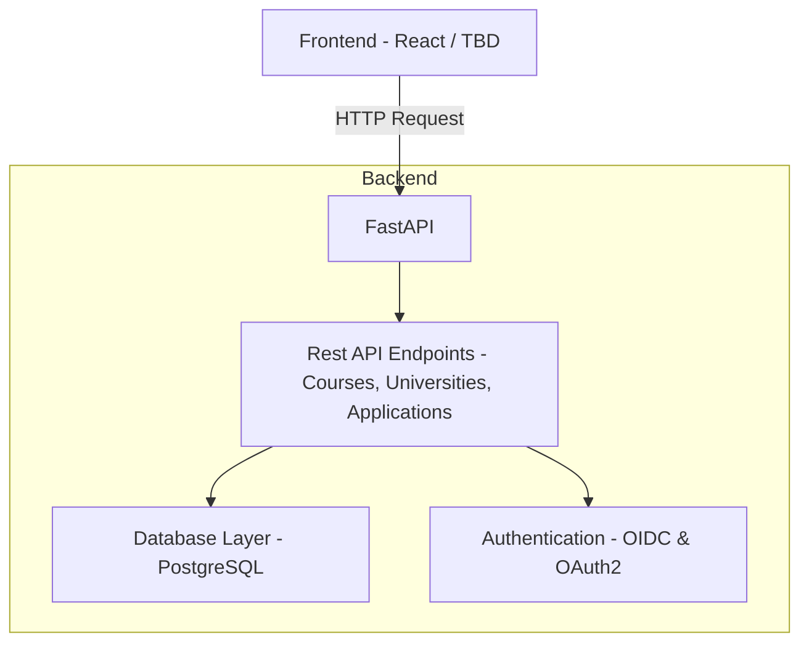

# Qtill

Helping students and educators.

## Architecture

The frontend is React / TBD, responsible for the user interface.
The backend uses FastAPI with postgress, to expose a Rest API for various resources (like courses, candidates, and applications).
User authentication will be handled with OIDC.

### Diagram

